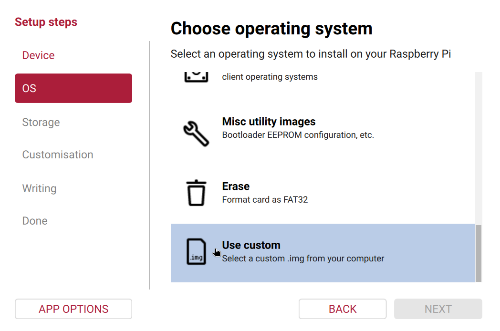

# <a name="HedgehogRaspi"></a>Running Hedgehog Linux on Raspberry Pi

[Hedgehog Linux](hedgehog.md) can be run on some models of the Raspberry Pi, providing a low-cost network sensor suitable for capturing traffic in networks with a smaller traffic footprint.

* [Obtaining the Hedgehog Linux for Raspberry Pi Image](#HedgehogRaspiBuild)
* [Writing the Image to Flash Media](#HedgehogRaspiBurn)
* [Setting Passwords](#HedgehogRaspiPassword)
* [Configuration](#HedgehogRaspiConfig)
* [Performance Considerations](#HedgehogRaspiPerformance)

## <a name="HedgehogRaspiBuild"></a>Obtaining the Hedgehog Linux for Raspberry Pi Image

The official Hedgehog Linux for Raspberry Pi image archive [can be downloaded from GitHub](download.md#DownloadISOs). It can also be built easily on an Internet-connected system with Vagrant:

* [Vagrant](https://www.vagrantup.com/)
    - [`bento/debian-13`](https://app.vagrantup.com/bento/boxes/debian-13) Vagrant box

The build should work with a variety of [Vagrant providers](https://developer.hashicorp.com/vagrant/docs/providers):

* [VMware](https://www.vmware.com/) [provider](https://developer.hashicorp.com/vagrant/docs/providers/vmware)
    - [`vagrant-vmware-desktop`](https://github.com/hashicorp/vagrant-vmware-desktop) plugin
* [libvirt](https://libvirt.org/) 
    - [`vagrant-libvirt`](https://github.com/vagrant-libvirt/vagrant-libvirt) provider plugin
    - [`vagrant-mutate`](https://github.com/sciurus/vagrant-mutate) plugin to convert the [`bento/debian-13`](https://app.vagrantup.com/bento/boxes/debian-13) Vagrant box to `libvirt` format
* [VirtualBox](https://www.virtualbox.org/) [provider](https://developer.hashicorp.com/vagrant/docs/providers/virtualbox)
    - [`vagrant-vbguest`](https://github.com/dotless-de/vagrant-vbguest) plugin

To perform a clean build of the Hedgehog Linux Raspberry Pi image, navigate to your local [Malcolm]({{ site.github.repository_url }}/) working copy and run:

```
$ ./hedgehog-raspi/build_via_vagrant.sh -f -z
…
Starting build machine...
Bringing machine 'vagrant-hedgehog-raspi' up with 'virtualbox' provider...
…
```

Building the image should take under 30 minutes on a native ARM64 system; however, if building on an amd64 platform, the process will involve cross-compiling for the ARM64 architecture and may take five or more hours depending on your system. When the build finishes, you will see the following message indicating success:

```
…
2024-01-21 05:11:44 INFO All went fine.
2024-01-21 05:11:44 DEBUG Ending, all OK
…
```

## <a name="HedgehogRaspiBurn"></a>Writing the Image to Flash Media

The resulting `.img.xz` file can be written to a microSD card or other bootable media using the [Raspberry Pi Imager](https://www.raspberrypi.com/documentation/computers/getting-started.html#raspberry-pi-imager) or `dd`.



## <a name="HedgehogRaspiPassword"></a>Setting Passwords

The provided image allows local login, requiring physical access, with the `sensor` account using the default password `Hedgehog_Linux`. On first login, the user is required to change this password. Login as `root` is disabled by default. After the `sensor` password has been changed, a `root` password may be set using `sudo passwd root` if desired.

```
Hedgehog-rpi-4 login: sensor
Password:
You are required to change your password immediately (administrator enforced).
Changing password for sensor.
Current password: **************
New password: ****************
Retype new password: ****************
sensor@Hedgehog-rpi-4:~$ sudo passwd root
[sudo] password for sensor: ****************
New password: ****************
Retype new password: ****************
passwd: password updated successfully
```

## <a name="HedgehogRaspiConfig"></a>Configuration

Once Hedgehog Linux has booted, [configuration](malcolm-hedgehog-e2e-iso-install.md#MalcolmConfig) can proceed using Malcolm's [`./scripts/configure` script](ubuntu-install-example.md#UIOpts).

## <a name="HedgehogRaspiPerformance"></a>Performance Considerations

Due to the Raspberry Pi's hardware and resource constraints, there are a few things to take into consideration:

* **Compatible hardware** — Hedgehog Linux will only run on Raspberry Pi 4B with 8GB RAM or higher.
* **Network interfaces** — Because the Raspberry Pi has only one Ethernet port, it is recommended to use a gigabit USB 3.0 Ethernet adapter (connected to one of the Pi's USB 3.0 ports) to add a second network interface, so that one may be used for management and the other for capture.
* **Network throughput** — A Raspberry Pi running Hedgehog Linux should probably be used to monitor "quiet" (low-throughput) networks. The Packet Capture Statistics [dashboard](dashboards.md#PrebuiltVisualizations) may help identify capture loss on the device.
* **Feature set** — Not every capture feature should be enabled when running Hedgehog on Raspberry Pi. Users experiencing poor performance may consider:
    * Turning off [automatic file extraction and scanning](file-scanning.md#ZeekFileExtraction)
    * Not using [Zeek intelligence](zeek-intel.md#ZeekIntel) if the number of indicators is large
    * Disabling full PCAP capture (i.e., not enabling Arkime's `capture`, `tcpdump`, or `netsniff-ng`), which would still provide network traffic metadata generated by Zeek and Suricata at the cost of not generating Arkime session records or storing the underlying full PCAP
* **Storage media** — Using faster storage (e.g., a SATA solid-state drive connected to the Pi's USB 3.0 port via a USB 3.0-to-SATA adapter, or an NVMe M.2 SSD) for the Hedgehog Linux OS drive and capture artifact directories will result in much better performance than writing to a microSD card.
